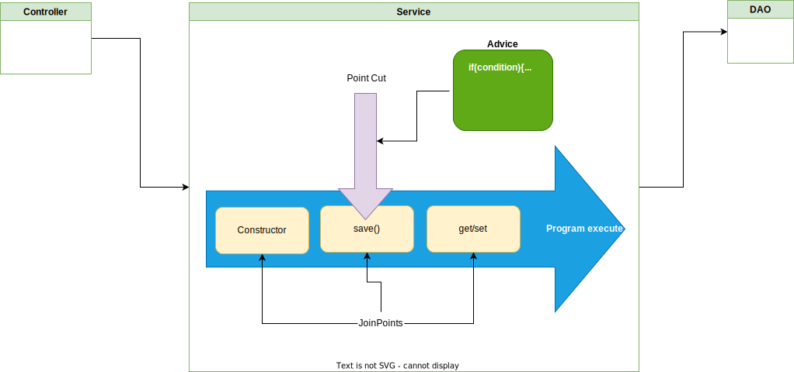
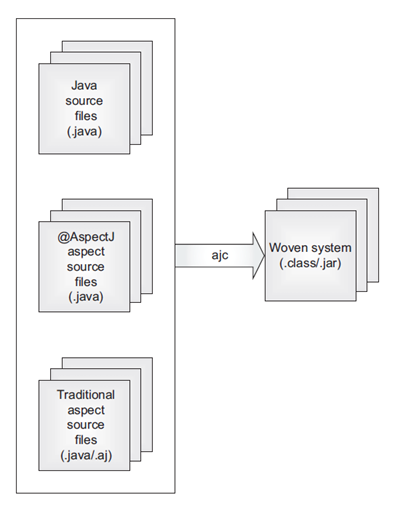

https://en.wikipedia.org/wiki/Aspect-oriented_programming

Agenda

1. Action demo withdraw
2. Show some intruduce about aspect
3. Show how to implement
4. Create your own annotaion + hibernate validator

## Introduction
In computing, aspect-oriented programming (AOP) is a programming paradigm that aims to increase modularity by allowing the separation of cross-cutting concerns.

It does so by **adding behavior to existing code** (an advice) **without modifying the code itself**

**Joinpoint** – it's a particular point during execution of programs like method execution, constructor call, or field assignment

**Advice** – the action taken by the aspect in a specific joinpoint

**Pointcut** – a regular expression that matches a joinpoint. Each time any join point matches a pointcut, a specified

## AspectJ and Spring AOP
### AspectJ
compile-time weaving is much faster than runtime weaving

### Spring AOP

### AspectJ vs Spring AOP
Spring AOP aims to provide a simple AOP implementation across Spring IoC to solve the most common problems that programmers face.

**It is not intended as a complete AOP solution** – it can only be applied to beans that are managed by a Spring container.

AspectJ is the original AOP technology which aims to provide **complete AOP solution**

<table>
    <thead>
    <tr>
        <th>Joinpoint</th>
        <th>Spring AOP Supported</th>
        <th>AspectJ Supported</th>
    </tr>
    </thead>
    <tbody>
    <tr>
        <td>Method Call</td>
        <td>No</td>
        <td>Yes</td>
    </tr>
    <tr>
        <td>Method Execution</td>
        <td>Yes</td>
        <td>Yes</td>
    </tr>
    <tr>
        <td>Constructor Call</td>
        <td>No</td>
        <td>Yes</td>
    </tr>
    <tr>
        <td>Constructor Execution</td>
        <td>No</td>
        <td>Yes</td>
    </tr>
    <tr>
        <td>Static initializer execution</td>
        <td>No</td>
        <td>Yes</td>
    </tr>
    <tr>
        <td>Object initialization</td>
        <td>No</td>
        <td>Yes</td>
    </tr>
    <tr>
        <td>Field reference</td>
        <td>No</td>
        <td>Yes</td>
    </tr>
    <tr>
        <td>Field assignment</td>
        <td>No</td>
        <td>Yes</td>
    </tr>
    <tr>
        <td>Handler execution</td>
        <td>No</td>
        <td>Yes</td>
    </tr>
    <tr>
        <td>Advice execution</td>
        <td>No</td>
        <td>Yes</td>
    </tr>
    </tbody>
</table>

