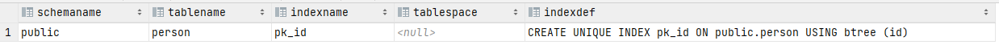
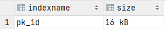

# Database index

## Purpose

Suppose we have a table similar to this:
```sql
CREATE TABLE person
(
    id   integer,
    name character varying(50),
    CONSTRAINT pk_id PRIMARY KEY (id)
);
```

and the application issues many queries of the form:
```sql
SELECT * FROM person WHERE id = 123456789;
```

With no advance preparation, the system would have to scan the entire **person** table, row by row, to find all matching entries. 

If there are many rows in **person** and only a few rows (perhaps zero or one) that would be returned by such a query, this is clearly an inefficient method.

But if the system has been instructed to maintain an index on the id column, it can use a more efficient method for locating matching rows.

For instance, it might only have to walk a few levels deep into a search tree.

### Real life sample
A similar approach is used in most non-fiction books: terms and concepts that are frequently looked up by readers are collected in an alphabetic index at the end of the book. 

The interested reader can scan the index relatively quickly and flip to the appropriate page(s), rather than having to read the entire book to find the material of interest. 

Just as it is the task of the author to anticipate the items that readers are likely to look up, it is the task of the database programmer to foresee which indexes will be useful.

### View index information
```sql
select *
from pg_indexes
where tablename = 'person';
```


```sql
select indexname, pg_size_pretty(pg_relation_size(indexname::regclass)) as size
from pg_indexes
where tablename = 'person';
```


## Demostrade (Postgres)